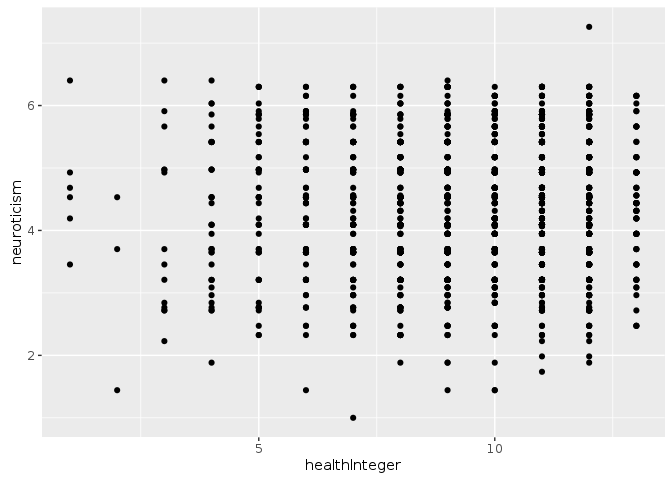
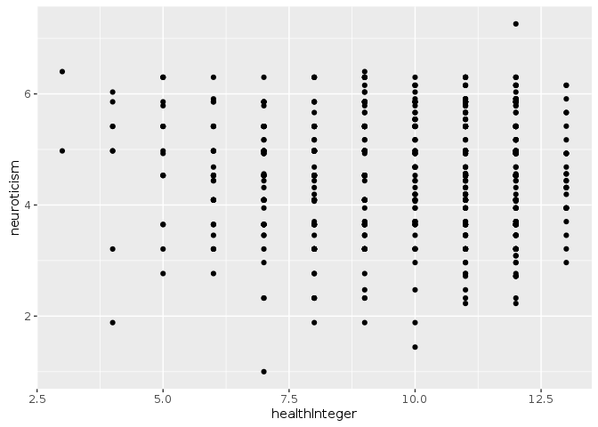

Vectorisation
=============

<!--sec data-title="Learning Objective" data-id="obj" data-show=true data-collapse=false ces-->
-   To understand vectorised operations in R.

<!--endsec-->
<br>

------------------------------------------------------------------------

**Table of Contents**

<!-- toc -->
<br>

------------------------------------------------------------------------

Most of R's functions are vectorised, meaning that the function will
operate on all elements of a vector without needing to loop through and
act on each element one at a time. This makes writing code more concise,
easy to read, and less error prone.

    x <- 1:4
    x * 2

    ## [1] 2 4 6 8

The multiplication happened to each element of the vector.

We can also add two vectors together:

    y <- 6:9
    x + y

    ## [1]  7  9 11 13

Each element of `x` was added to its corresponding element of `y`:

    x:  1  2  3  4
        +  +  +  +
    y:  6  7  8  9
    ---------------
        7  9 11 13

<!--sec data-title="Challenge 1" data-id="ch1" data-show=true data-collapse=false ces-->
Let's try this on the `health` column of the `healthData` dataset.

Make a new column in the `healthData` data frame that contains health
rounded to the nearest integer. Check the head or tail of the data frame
to make sure it worked.

**Hint**: R has a round() function

<!--endsec-->
<!--
> ## Challenge 2 {.challenge}
>
> On a single graph, plot neuroticism against health rounded to the nearest integer, 
> for each of the study groups.
>
> Repeat the exercise, graphing only for people with: conscientiousnss greater than 5, 
> self-rated health below 7, and alcohol use in young adulthood of 2.
>
-->
Comparison operators, logical operators, and many functions are also
vectorized:

**Comparison operators**

    x > 2

    ## [1] FALSE FALSE  TRUE  TRUE

**Logical operators**

    a <- x > 3  # or, for clarity, a <- (x > 3)
    a

    ## [1] FALSE FALSE FALSE  TRUE

<!--sec data-title="Tip: Some useful functions forlogical vectors" data-id="tip1" data-show=true data-collapse=true ces-->
`any()` will return `TRUE` if *any* element of a vector is `TRUE`
`all()` will return `TRUE` if *all* elements of a vector are `TRUE`

<!--endsec-->
Most functions also operate element-wise on vectors:

**Functions**

    x <- 1:4
    log(x)

    ## [1] 0.0000000 0.6931472 1.0986123 1.3862944

Vectorised operations work element-wise on matrices:

    m <- matrix(1:12, nrow=3, ncol=4)
    m * -1  

    ##      [,1] [,2] [,3] [,4]
    ## [1,]   -1   -4   -7  -10
    ## [2,]   -2   -5   -8  -11
    ## [3,]   -3   -6   -9  -12

<!--sec data-title="Tip: Element-wise vs. matrix multiplication" data-id="tip2" data-show=true data-collapse=true ces-->
Very important: the operator `*` gives you element-wise multiplication!
To do matrix multiplication, we need to use the `%*%` operator:

    m %*% matrix(1, nrow=4, ncol=1)

    ##      [,1]
    ## [1,]   22
    ## [2,]   26
    ## [3,]   30

    matrix(1:4, nrow=1) %*% matrix(1:4, ncol=1)

    ##      [,1]
    ## [1,]   30

For more on matrix algebra, see the [Quick-R reference
guide](http://www.statmethods.net/advstats/matrix.html)

<!--endsec-->
<!--sec data-title="Challenge 2" data-id="ch2" data-show=true data-collapse=false ces-->
Given the following matrix:

    m <- matrix(1:12, nrow=3, ncol=4)
    m

    ##      [,1] [,2] [,3] [,4]
    ## [1,]    1    4    7   10
    ## [2,]    2    5    8   11
    ## [3,]    3    6    9   12

Write down what you think will happen when you run:

1.  `m ^ -1`
2.  `m * c(1, 0, -1)`
3.  `m > c(0, 20)`
4.  `m * c(1, 0, -1, 2)`

Did you get the output you expected? If not, ask a helper!

<!--endsec-->
<!--sec data-title="Challenge 3" data-id="ch3" data-show=true data-collapse=false ces-->
We're interested in looking at the sum of the following sequence of
fractions:

    x = 1/(1^2) + 1/(2^2) + 1/(3^2) + ... + 1/(n^2)

This would be tedious to type out, and impossible for high values of n.
Use vectorisation to compute x when n=100. What is the sum when
n=10,000?

<!--endsec-->
<br>

------------------------------------------------------------------------

Challenge solutions
-------------------

<!--sec data-title="Solution to Challenge 1" data-id="ch1sol" data-show=true data-collapse=true ces-->
Let's try this on the `health` column of the `healthData` dataset.

Make a new column in the `healthData` data frame that contains health
rounded to the nearest integer. Check the head or tail of the data frame
to make sure it worked.

Hint: R has a round() function

    healthData$healthInteger <- round(healthData$health)
    head(healthData)

    ##   id conscientiousness extraversion intellect agreeableness neuroticism
    ## 1  3             5.825        3.986     6.044         4.613       3.649
    ## 2  4             7.732        7.016     6.821         6.649       6.299
    ## 3  7             6.498        2.697     5.527         3.087       4.091
    ## 4  8             5.881        2.504     4.234         4.613       3.649
    ## 5 10             4.254        5.147     4.751         3.850       3.208
    ## 6 12             7.508        3.535     6.821         4.613       5.415
    ##    sex selfRatedHealth mentalAdjustment illnessReversed health
    ## 1 Male               4                2               3   6.74
    ## 2 Male               5                3               5  11.96
    ## 3 Male               3                3               4   8.05
    ## 4 Male               3                2               4   6.48
    ## 5 Male               4                2               3   6.74
    ## 6 Male               4                2               5   9.01
    ##   alcoholUseInYoungAdulthood education birthYear HIGroup healthInteger
    ## 1                          2         9      1909 Group 1             7
    ## 2                          3         8      1905 Group 1            12
    ## 3                          2         6      1910 Group 1             8
    ## 4                          1         8      1905 Group 1             6
    ## 5                          2         9      1910 Group 1             7
    ## 6                          2         4      1911 Group 1             9

<!--endsec-->
<!--sec data-title="Solution to Challenge 2" data-id="ch2sol" data-show=true data-collapse=true ces-->
<!--
> ## Solution to challenge 2 {.challenge}
>
>
> On a single graph, plot neuroticism against health rounded to the nearest integer, 
> for each of the study groups.
>
> Repeat the exercise, graphing only for people with: conscientiousnss greater than 5, 
> self-rated health below 7, and alcohol use in young adulthood of 2.
>
>
> 
> ```r
>  ggplot(healthData, aes(x = healthInteger, y = neuroticism)) + 
>   geom_point()
> ```
> 
> 
> 
> ```r
>  ggplot(healthData[healthData$conscientiousness > 5 & healthData$selfRatedHealth < 7 & healthData$alcoholUseInYoungAdulthood == 2,],
>         aes(x = healthInteger, y = neuroticism)) + 
>    geom_point()
> ```
> 
> 
>
-->
Given the following matrix:

    m <- matrix(1:12, nrow=3, ncol=4)
    m

    ##      [,1] [,2] [,3] [,4]
    ## [1,]    1    4    7   10
    ## [2,]    2    5    8   11
    ## [3,]    3    6    9   12

Write down what you think will happen when you run:

1.  `m ^ -1`

<!-- -->

    ##           [,1]      [,2]      [,3]       [,4]
    ## [1,] 1.0000000 0.2500000 0.1428571 0.10000000
    ## [2,] 0.5000000 0.2000000 0.1250000 0.09090909
    ## [3,] 0.3333333 0.1666667 0.1111111 0.08333333

1.  `m * c(1, 0, -1)`

<!-- -->

    ##      [,1] [,2] [,3] [,4]
    ## [1,]    1    4    7   10
    ## [2,]    0    0    0    0
    ## [3,]   -3   -6   -9  -12

1.  `m > c(0, 20)`

<!-- -->

    ##       [,1]  [,2]  [,3]  [,4]
    ## [1,]  TRUE FALSE  TRUE FALSE
    ## [2,] FALSE  TRUE FALSE  TRUE
    ## [3,]  TRUE FALSE  TRUE FALSE

<!--endsec-->
<!--sec data-title="Solution to Challenge 3" data-id="ch3sol" data-show=true data-collapse=true ces-->
We're interested in looking at the sum of the following sequence of
fractions:

    x = 1/(1^2) + 1/(2^2) + 1/(3^2) + ... + 1/(n^2)

This would be tedious to type out, and impossible for high values of n.
Can you use vectorisation to compute x, when n=100? How about when
n=10,000?

    sum(1/(1:100)^2)

    ## [1] 1.634984

    sum(1/(1:1e04)^2)

    ## [1] 1.644834

    n <- 10000
    sum(1/(1:n)^2)

    ## [1] 1.644834

We can also obtain the same results using a function:

    inverse_sum_of_squares <- function(n) {
       sum(1/(1:n)^2)
    }
    inverse_sum_of_squares(100)

    ## [1] 1.634984

    inverse_sum_of_squares(10000)

    ## [1] 1.644834

    n <- 10000
    inverse_sum_of_squares(n)

    ## [1] 1.644834

<!--endsec-->
